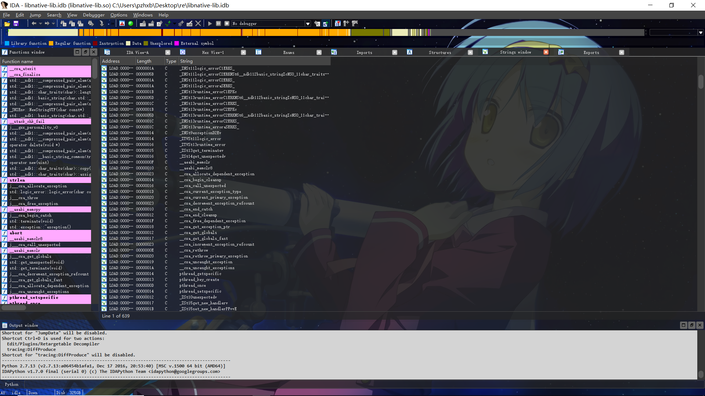

自己糊的一个ida_skin的主题


效果：




todolist：

有一些窗口没有透明化，因为估计那几个窗口的类的某些方法被重写了，普通的方法并没有办法更改背景的透明度，而现在测试的可以改那几个窗口的脚本如下：

```python
from PyQt5.Qt import qApp
from PyQt5.QtWidgets import QWidget,QGraphicsOpacityEffect
from PyQt5.QtCore import Qt
c = qApp.allWidgets()
for i in c:
    if i.objectName()=='qt_scrollarea_viewport' :
        opacityEffect = QGraphicsOpacityEffect()
        i.setGraphicsEffect(opacityEffect)
        opacityEffect.setOpacity(0.5);
```

但是这样的改法会导致字体也变透明，影响了正常的使用

目前正在尝试一些其他的歪门邪道来对付着几个窗口（

嗯，那几个窗口的绘图函数在sub_361D0，真难，他也不是用背景设置来搞的，而是直接用Brush刷成背景颜色的，思考中。。。。。。。
