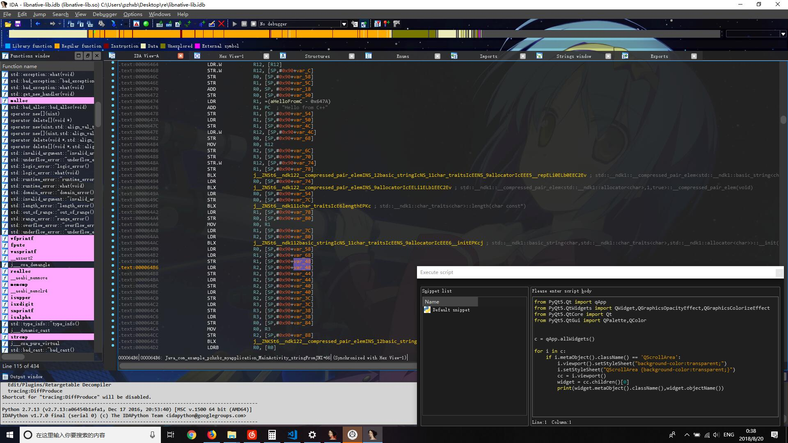
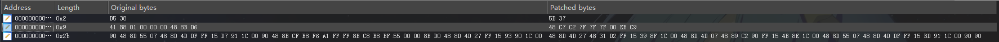

自己糊的一个ida_skin的主题

效果：

逆向工作已经完成，通过逆向发现主要的三个窗口类型为QPixmap，在3E5F0创建之后再传进去进行绘画操作，而在这个QPixmap创建的时候，没有进行背景颜色的初始化，导致背景一直为黑色。

而传入各个窗口的不同绘画窗口之后，最终都会到361D0进行各个文字及背景的绘画。

patch的思路就是在QPixmap创建的时候帮他进行背景颜色的初始化，再patch掉后面填充背景的逻辑。即可实现透明

目前的patch（仅限32位的那个ida）：

todo：

把patch逻辑写进插件，实现自动patch。

优化patch，目前还有一些bug。

再调整各个部件的透明度，再更好看一点:P